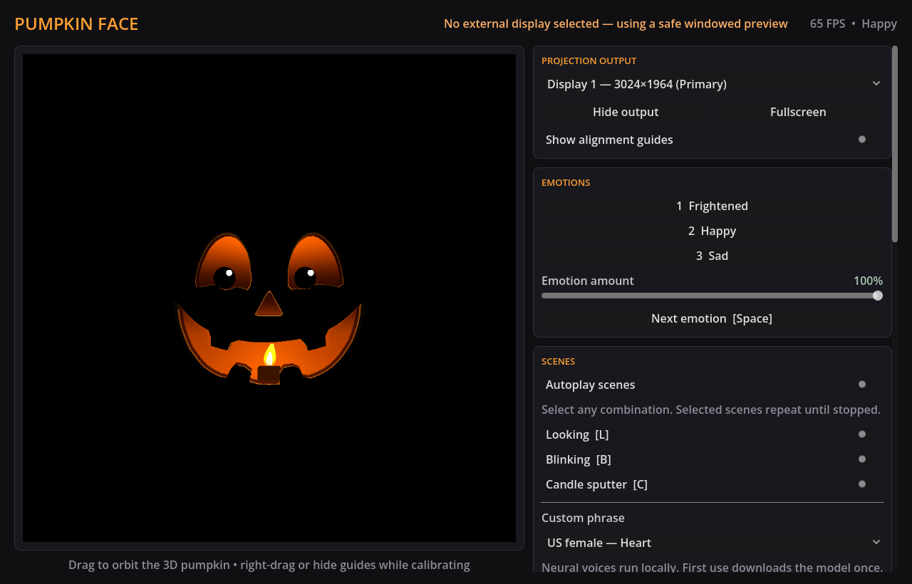

# Pumpkin Face

Pumpkin Face is a cross-platform puppeteering app for projecting an animated jack-o-lantern face onto a physical pumpkin. A private operator window controls a separate, clean projector output, so the performer can change the character without showing controls to the audience.



The operator can switch between frightened, happy, and sad expressions; combine looking, blinking, and candle-sputter scenes; type phrases for locally generated speech; and calibrate the face to the pumpkin and projector. Scene autoplay can run the decoration unattended.

The projected face is rendered as a GPU-accelerated 3D carving with recessed cut walls, candlelight, deformable expressions, and speech-ready mouth geometry. Everything outside the carving remains black so the physical pumpkin supplies the visible surface.

## Requirements

- macOS, Windows, or Linux for development; the supplied export preset currently targets macOS.
- [.NET 8 SDK](https://dotnet.microsoft.com/download/dotnet/8.0). [`global.json`](global.json) pins SDK 8.0.100 and permits compatible patch updates in that feature band.
- [Godot 4.7.1 .NET](https://godotengine.org/download/archive/4.7.1-stable/), not the standard non-.NET editor.
- Matching Godot 4.7.1 export templates to produce the macOS application bundle.
- A GPU and graphics driver capable of Godot's Compatibility renderer.
- About 400 MB of free space for the local Kokoro voice model. It is downloaded once, on the first neural phrase, into the app's private data directory.

The examples use `godot-mono` as the Godot executable. If it is not on your `PATH`, replace it with the editor executable, such as `/Applications/Godot_mono.app/Contents/MacOS/Godot` on macOS.

Verify the installed tools:

```sh
dotnet --version
godot-mono --version
```

The Godot version should report `4.7.1.stable.mono`.

## Build and run

From the repository root:

```sh
dotnet restore PumpkinFace.sln
dotnet build PumpkinFace.sln
godot-mono --editor --path src/PumpkinFace.Display
```

Press **F5** or the editor's Run Project button after Godot opens. To launch the application directly without opening the editor:

```sh
godot-mono --path src/PumpkinFace.Display
```

For a real projection, configure the projector as an **extended display**, not a mirrored display, before launching. Keep the operator window on the primary display and select the projector from **Projection output**.

## Operator controls

The operator window contains the exact projector preview, emotion controls, action scenes, pumpkin-lighting controls, named calibration profiles, and fine adjustment controls. The **Emotion amount** slider softens or strengthens the selected expression while preserving its traced identity. **Candle brightness** scales the flame, internal light, reflected cavity light, and shell transmission together. **Shell thickness** changes the recessed inner wall, carving depth, and visible width of the cut-flesh ring, so its effect remains apparent in the straight-on orthographic preview. Both values are stored in calibration profiles. The projector window contains only the face on black. Typed speech defaults to **Neural — Heart**; the first use downloads the model, while later phrases synthesize entirely on the computer without an internet connection.

| Control | Action |
| --- | --- |
| `Space` | Play the next shuffled emotion now |
| `1` | Play Frightened |
| `2` | Play Happy |
| `3` | Play Sad |
| `L` | Toggle the Looking scene |
| `B` | Toggle the Blinking scene |
| `C` | Toggle the Candle Sputter scene |
| `A` | Toggle scene autoplay |
| `F` | Toggle projector fullscreen |
| `Esc` | Leave projector fullscreen without quitting |

The keyboard shortcuts apply while the operator application has keyboard focus. The same emotion, scene, autoplay, output, and fullscreen actions are available as buttons.

Drag normally inside the operator preview to orbit the 3D camera around the pumpkin. When alignment guides are visible, right-drag performs the orbit so left-drag can continue moving and resizing the calibrated projection. Five seconds after the last orbit input, the camera quickly returns to its default front view.

### Safe output behavior

- At startup, a remembered display is reused when it still exists. If it is missing—or no display has been saved yet—the output opens safely windowed on the primary display.
- Automatic fullscreen is used only on a non-primary display when more than one display is available.
- With one display or the primary display selected, output opens as a centered 960×540 borderless window and the operator shows a warning.
- The output can be hidden and restored without closing the operator window.
- The projector background remains black, and the cursor is hidden while it is over fullscreen output.
- Alignment guides are off by default. Turning them on intentionally shows them in both preview and projector output, so turn them off before the decoration is presented.

### Align the face

Enable **Show alignment guides** to expose direct controls in the operator preview:

- Drag inside the face outline to move it.
- Drag a corner handle to scale it uniformly.
- Drag the top handle to rotate it.

Fine controls independently adjust horizontal and vertical position and scale, rotation, eye spacing, mouth position and scale, brightness, and gamma.

## Calibration profiles

Profiles let one computer remember different pumpkins, projector placements, or throw distances. The profile panel can create, rename, duplicate, delete, reset, and select profiles. **New** starts from the current calibration; **Duplicate** makes a named copy; **Reset selected profile** restores neutral alignment. The final remaining profile cannot be deleted.

Profile edits, autoplay state, and the selected display are saved automatically after a short debounce and flushed during normal shutdown. The versioned JSON state and recovery backup live under Godot's platform-specific user data directory at:

```text
user://pumpkin-face/application-state.json
user://pumpkin-face/application-state.backup.json
```

Writes use a temporary file and atomic replacement where the platform supports it. On startup, an invalid primary file falls back to the last-known-good backup and then safe defaults. Avoid editing these files while the application is running.

## Tests and project validation

Run all deterministic core and persistence tests:

```sh
dotnet test PumpkinFace.sln
```

The suites cover command ordering and capacity, shuffle timing, interruption, same-scene retrigger and autoplay rules, pose interpolation and clamping, calibration validation, profile round trips/migration/recovery, speech planning, and speech timing contracts.

Use Godot headlessly for a resource/import/C# smoke check:

```sh
godot-mono --headless --path src/PumpkinFace.Display --editor --build-solutions --quit
```

This smoke check does not validate native multi-display behavior or captured pixels. Those require an active desktop session.

## Deterministic visual captures

Capture mode renders nine fixed expression poses, one reduced-intensity pose, minimum/maximum shell-thickness checks, four action-scene frames, and two camera-orbit views at 1280×720. It fixes the procedural candle clock, disables alignment guides, and exits automatically.

Image capture requires a real GPU-backed, windowed Godot session. **Do not add `--headless` or use a dummy display driver**: a headless smoke check can load resources, but it cannot reliably read back the application's GPU viewport.

Create or refresh a reference set:

```sh
godot-mono --path src/PumpkinFace.Display -- \
  --capture-dir="$PWD/captures/reference"
```

Compare a new capture with that reference set:

```sh
godot-mono --path src/PumpkinFace.Display -- \
  --capture-dir="$PWD/captures/actual" \
  --compare-dir="$PWD/captures/reference"
```

Comparison uses luma root-mean-square error with a tolerance of `0.035`. A successful run exits with code `0`; missing references, size changes, save failures, or visual differences above the threshold exit with code `2`; an unavailable GPU framebuffer exits with code `3` and an actionable message. Keep reference images tied to a known Godot version, renderer, and GPU because driver changes can produce small pixel differences.

## Export an unnotarized macOS app

Install the Godot 4.7.1 export templates, then run:

```sh
mkdir -p dist
godot-mono --headless --path src/PumpkinFace.Display \
  --export-release "macOS" "$PWD/dist/PumpkinFace.app"
```

The preset creates a universal macOS bundle using Apple's system `codesign` with the certificate-free `-` ad-hoc identity. It has no Apple Developer ID identity and is not notarized; the ad-hoc signature is required for a reliable launch on Apple Silicon but does not establish a trusted publisher. On another Mac, Finder may require **Control-click → Open** on first launch. Developer ID signing and notarization are intentionally outside V1.

Only the macOS export preset is currently supplied. The application architecture is portable, but Windows and Linux packages require corresponding Godot export presets and platform testing.
