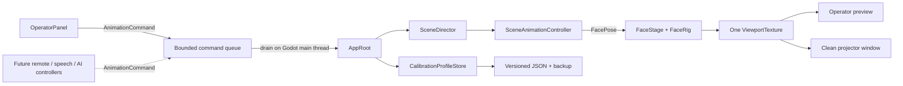

# Pumpkin Face architecture

## Design intent

Pumpkin Face separates deterministic animation decisions from Godot rendering. UI, future network controllers, speech systems, and local AI should request high-level actions through the same command boundary; only the Godot main thread is allowed to change animation or graphics state.

The other central invariant is that the operator preview and projector output never render separate copies of the face. A single GPU-backed `SubViewport` produces one `ViewportTexture`, which both windows consume. This keeps timing, calibration, procedural candle movement, and guide visibility synchronized.

## Solution layout

### `PumpkinFace.Core`

`src/PumpkinFace.Core` targets plain .NET 8 and has no Godot dependency. It contains:

- `SceneId` and the `AnimationCommand` records.
- `IAnimationCommandSink`, `IAnimationCommandSource`, and `BoundedAnimationCommandQueue`.
- `SceneDirector`, deterministic timing, shuffle-bag selection, and transition snapshots.
- `FacePose`, channel groups, clamping, and interpolation.
- `ProjectionCalibration` and its validation/normalization rules.
- `VisemeFrame`, `Viseme`, and `IAudioClock` extension contracts for speech.

Keeping these types engine-independent makes scheduler and controller logic testable without starting Godot. It also allows a future ASP.NET Core service or local-model host to reference the same contracts.

### `PumpkinFace.Display`

`src/PumpkinFace.Display` is a Godot 4.7.1 .NET project using the Compatibility renderer:

| Area | Responsibility |
| --- | --- |
| `App/AppRoot.cs` | Composition root, main-thread command drain, startup restoration, keyboard input, and component coordination |
| `App/ProjectorHost.cs` | Separate native output window, display enumeration, fullscreen state, cursor behavior, and safe windowed fallback |
| `Animation/SceneAnimationController.cs` | Runtime-authored `AnimationPlayer` clips and layered `AnimationTree` |
| `Animation/FacePoseDriver.cs` | Godot-animatable properties converted into a core `FacePose` |
| `Rendering/FaceStage.cs` | Shared `SubViewport`, projection transform, resolution changes, guide visibility, and deterministic shader time |
| `Rendering/FaceRig.cs` | Procedural eye, pupil, mouth, ember, charred-edge, and glow geometry |
| `Rendering/ProjectionGuides.cs` | Face and framebuffer alignment overlays |
| `Shaders/` | Animated carved-interior texture and soft glow passes |
| `UI/OperatorPanel.cs` | Operator-only controls and status surface |
| `UI/ProjectionPreview.cs` | Exact framebuffer preview and move/scale/rotate handles |
| `Persistence/` | Versioned named profiles, migration/recovery, and debounced atomic saves |
| `Capture/DeterministicCaptureRunner.cs` | Fixed-pose GPU capture and perceptual comparison harness |

`Scenes/Main.tscn` deliberately contains only `AppRoot`; the remaining nodes are composed in code so ownership and future injection points remain explicit.

### Test projects

`tests/PumpkinFace.Core.Tests` exercises logic that must remain deterministic across render rates: queue behavior, scheduling, interruption, autoplay, pose math, calibration, serialization, and audio-timeline contracts.

`tests/PumpkinFace.Display.Tests` exercises the engine-independent profile store through the Display assembly: JSON round trips, profile operations, legacy migration, corrupt-primary recovery, and safe fallback.

## Runtime flow

1. `AppRoot` checks user arguments. `--capture-dir` starts the capture-only path; otherwise normal operator mode starts.
2. `CalibrationProfileStore` loads the primary state, a recovery backup, or safe defaults.
3. `AppRoot` creates the face stage, animation controller, projector host, and operator panel.
4. One `ViewportTexture` from `FaceStage` is assigned to both the operator preview and projector surface.
5. The saved display is restored when valid. If it is unavailable—or this is the first run—the output opens safely windowed on the primary display and reports a warning.
6. UI and keyboard input post immutable commands to a capacity-64 `BoundedAnimationCommandQueue`.
7. Each Godot process frame, `AppRoot` drains commands on the main thread, updates `SceneDirector`, synchronizes the `AnimationTree`, and sends the current clamped `FacePose` to `FaceStage`.
8. `FaceStage` advances one shared animation time for candle shaders and whole-face tremble.

The queue rejects a new command when full rather than silently discarding a previously accepted action. Producers receive `false`; the operator UI reports that the control queue is busy. Background producers must never invoke Godot node methods directly.

## Scheduling and animation

`SceneDirector` is constructed with the fixed seed `0x504B4E` in V1, making its shuffle and sampled durations reproducible. Autoplay behavior is:

- Neutral pause: 3–8 seconds.
- Watchful: 9.5–10.5 seconds.
- Frightened: 4.75–5.25 seconds.
- Drowsy: 12–13 seconds.
- Mischievous: 8–9 seconds.
- A shuffled four-scene bag with no adjacent automatic repeats.

A manual scene or **Next scene** starts immediately. When it interrupts a running expression, the `AnimationTree` crosses to the new state over 250 ms. The scene plays once, returns to neutral, and resumes the autoplay delay only when autoplay remains enabled. Disabling autoplay lets a running scene finish; `StopCommand` cancels immediately and disables autoplay, although V1 does not expose a Stop button.

Each expression has two equivalent state-machine nodes backed by the same authored clip. Re-triggering the scene that is already playing alternates to its partner node, allowing a real 250 ms crossfade back to the beginning; a self-transition would either be ignored or restart abruptly. Scene requests received in one command-drain batch are coalesced to the final request. If another request arrives during a crossfade, it waits for that fade to finish and stretches its normalized clip over the director's remaining scene time, preventing queued state-machine travel from drifting away from scheduler completion.

Every authored scene is a normalized one-second clip. Its expression node stretches a custom timeline to the duration chosen by `SceneDirector`; the narrow per-scene range preserves a little deterministic autoplay variation without noticeably changing the acting tempo. The state machine itself continues on wall-clock time, so its crossfade remains a real 250 ms instead of stretching with a long scene.

Tracks use channel-appropriate interpolation. Gaze, eyelid, and tremble beats use linear keys with tightly spaced moves and explicit holds for readable darts, blinks, and accents. Brows, pupils, mouth shapes, and candle intensity retain cubic interpolation for organic settling and restrained light changes.

The `AnimationTree` evaluates three independent layers. An always-running `NeutralBaseline` supplies subtle breathing and candle variation. The expression state machine is converted to a delta by subtracting a constant reference pose, then added to that live baseline. A final filtered `SpeechMouthLayer` is currently silent and is restricted to the five mouth controls reserved for future visemes. Deterministic mixing keeps the additive math unnormalized.

## Rendering pipeline

`FaceStage` renders a 1600×900 design-space rig into a `SubViewport` sized to the selected projector output. It uses a fully black clear/background, resolution-independent polygon geometry, and shader-driven glow compatible with Godot's broad-hardware Compatibility renderer.

`FaceRig` rebuilds friendly asymmetric wedge eyes and a broad crescent mouth from pose controls. Two upper and one offset lower pumpkin-material bridges deform with that mouth to create chunky traditional teeth, and they recede for rounded gasp/yawn poses so the same controls remain usable by future visemes.

Every aperture is a procedural depth stack: restrained wide/tight spill, a thick soot-dark outer lip, directional cut-flesh wall quads, an offset dark cavity, and a smaller inset candle plane. Selected inner rims provide ember detail without tracing the entire opening like neon. Oversized dark pupils and small ember reflections remain readable against the warm cavity. The shaders receive an explicit animation clock, allowing normal real-time flame movement and frozen-time capture from the same code.

Projection calibration is applied above expression tremble:

- normalized X/Y output offset;
- independent X/Y scale;
- rotation;
- eye spacing;
- mouth X/Y offset and X/Y scale;
- brightness and gamma.

This is an affine projection adjustment. Keystone correction and arbitrary mesh warping would require a new transform/mesh layer between `FaceStage` and the output texture.

Guides are rendered inside the shared stage, so they intentionally appear on both consumers. The default is off, and no operator controls are children of the projector window.

## Persistence and recovery

The root `ApplicationStateDocument` and each `CalibrationProfile` carry schema versions. State includes named profiles, selected profile ID, autoplay, and last display index/label.

The default store resolves beneath `user://pumpkin-face` and writes:

- `application-state.json`;
- `application-state.backup.json`;
- a short-lived `.tmp` file during replacement.

Mutations update in-memory state synchronously on the main thread. Disk writes are debounced by 400 ms and serialized behind a write gate. Replacement is atomic where supported, with a portable backup-first fallback. Disposal flushes pending state.

Load recovery proceeds in order:

1. Read, migrate, validate, and repair the primary file.
2. Restore the last-known-good backup if primary is missing or invalid.
3. Archive an invalid primary when possible and create safe defaults if neither file is usable.

Persistence failures are returned to the operator as warnings; they do not put controls or error text into projector output.

## Deterministic capture

Capture mode is selected before normal UI and projector composition. It creates only `FaceStage`, `SceneAnimationController`, and `DeterministicCaptureRunner`. The runner:

- fixes the output at 1280×720;
- disables guides and automatic shader-time advancement;
- selects 13 fixed scene/progress pairs;
- waits three process frames for each pose to settle;
- writes PNGs and optionally compares them to matching references;
- uses luma RMSE with a maximum accepted difference of `0.035`;
- exits `0` on success, `2` after a capture/comparison failure, and `3` when no readable GPU framebuffer is available.

The capture path reads back a GPU `ViewportTexture`. Run it in an active windowed desktop session with a real graphics driver. Godot's `--headless`/dummy driver remains appropriate for project and resource smoke checks, but not for pixel capture. See the commands in the root README.

## Extension seams

### Speech and lip sync

The core already defines `Viseme`, timestamped/weighted `VisemeFrame`, and `IAudioClock`. `IAudioClock.AudiblePosition` accounts for output latency so mouth timing can follow what the audience hears instead of the render frame.

`SceneAnimationController` also reserves a filtered `SpeechMouthLayer` in its `AnimationTree`. That additive layer is limited to `JawOpen`, `MouthWidth`, `MouthRoundness`, `LeftMouthCorner`, and `RightMouthCorner`; gaze, eyelids, brows, tremble, and lighting remain owned by the expression beneath it.

A concrete next implementation should:

1. Add a Godot `AudioStreamPlayer` and an `IAudioClock` adapter using playback position and measured output latency.
2. Convert phoneme timing or an offline lip-sync model into ordered `VisemeFrame` values.
3. Interpolate neighboring frames against `AudiblePosition`.
4. Map each viseme to the five normalized mouth channels.
5. Replace/feed the current `SpeechRest` input and raise the speech-layer blend amount only while speech is active.

Audio must remain the master clock. Do not advance visemes by accumulating render-frame delta.

### Remote web control

`AnimationCommand` is the stable behavior vocabulary, and `IAnimationCommandSink.TryPost` is the producer boundary. A future ASP.NET Core controller can live in a new project that references `PumpkinFace.Core`.

For an embedded local service, expose the existing sink from `AppRoot`, host HTTP work away from the Godot main thread, and post validated commands into the thread-safe queue. For a separate companion process or secondary app, serialize a small allow-listed command DTO over loopback HTTP/WebSocket and translate it to core commands at the display boundary.

Recommended safety defaults are loopback-only binding, explicit opt-in before LAN access, authentication for non-loopback clients, rate limits below queue capacity, bounded payloads, and validation of enum/calibration ranges. A network request must never receive or mutate a Godot node reference.

### Local AI control

Run local inference outside the render loop, ideally in a worker or companion process. Give the model a small tool/schema that permits only high-level actions such as play scene, next, autoplay, and stop. Validate its output and post the resulting `AnimationCommand` through the same sink used by the operator and remote controller.

Keep model latency, cancellation, and failures independent of the 60 FPS renderer. The bounded queue is backpressure, not long-term planning storage; discard or coalesce stale AI intent before posting. Projection calibration should not be model-controlled without an explicit operator authorization path.

### Additional scenes and render controls

Adding a built-in expression currently requires coordinated changes to `SceneId`, `SceneTimings.For`, the runtime animation library/state machine, UI controls, and deterministic capture frames. Pose channels should remain normalized and renderer-independent. If a future feature needs a new channel, add it to `FacePose`, its `FacePoseChannels` group, driver, rig, clamps/interpolation tests, and speech filtering where relevant.

## Verification boundaries

Automated .NET tests do not validate native window placement, cursor hiding, GPU shader appearance, or actual projector latency. Before a show or release, manually verify:

- one-display startup uses a windowed warning fallback;
- a selected external display receives clean fullscreen output;
- closing/hiding and restoring output works;
- guides never remain enabled during presentation;
- profiles survive restart and recovery warnings remain operator-only;
- all keyboard actions work with operator focus;
- output remains fully black outside carved features;
- the cut-flesh walls and pupils remain readable at the intended ambient level and viewing distance;
- slight projector defocus and pumpkin ribs do not erase tooth gaps or turn the bevel into a flat outline;
- 1920×1080 autoplay holds the target frame rate during a 30-minute soak without steady memory growth.

The supplied macOS preset exports a universal bundle with only Apple's certificate-free ad-hoc integrity signature. Apple Developer ID signing and notarization, Windows/Linux presets, audio, remote control, AI inference, camera alignment, and corner-pin mapping remain deliberate V1 exclusions.
