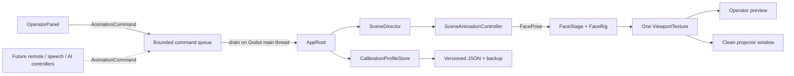

# Pumpkin Face architecture

## Design intent

Pumpkin Face separates deterministic animation decisions from Godot rendering. UI, future network controllers, speech systems, and local AI should request high-level actions through the same command boundary; only the Godot main thread is allowed to change animation or graphics state.

The other central invariant is that the operator preview and projector output never render separate copies of the face. A single GPU-backed `SubViewport` produces one `ViewportTexture`, which both windows consume. This keeps timing, calibration, procedural candle movement, and guide visibility synchronized.

```mermaid
flowchart LR
    UI["OperatorPanel"] -->|AnimationCommand| Queue["Bounded command queue"]
    Remote["Future remote / speech / AI controllers"] -.->|AnimationCommand| Queue
    Queue -->|drain on Godot main thread| Root["AppRoot"]
    Root --> Director["SceneDirector"]
    Director --> Anim["SceneAnimationController"]
    Anim -->|FacePose| Stage["FaceStage + FaceRig"]
    Root --> Store["CalibrationProfileStore"]
    Store --> JSON["Versioned JSON + backup"]
    Stage --> Texture["One ViewportTexture"]
    Texture --> Preview["Operator preview"]
    Texture --> Projector["Clean projector window"]
```

## Solution layout

### `PumpkinFace.Core`

`src/PumpkinFace.Core` targets plain .NET 8 and has no Godot dependency. It contains:

- `EmotionId`, action `SceneId`, and the `AnimationCommand` records.
- `IAnimationCommandSink`, `IAnimationCommandSource`, and `BoundedAnimationCommandQueue`.
- `SceneDirector`, deterministic timing, shuffle-bag selection, and transition snapshots.
- `FacePose`, channel groups, clamping, and interpolation.
- `ProjectionCalibration` and its validation/normalization rules.
- `VisemeFrame`, `Viseme`, and `IAudioClock` extension contracts for speech.

Keeping these types engine-independent makes scheduler and controller logic testable without starting Godot. It also allows a future ASP.NET Core service or local-model host to reference the same contracts.

### `PumpkinFace.Display`

`src/PumpkinFace.Display` is a Godot 4.7.1 .NET project using the Compatibility renderer:

| Area | Responsibility |
| --- | --- |
| `App/AppRoot.cs` | Composition root, main-thread command drain, startup restoration, keyboard input, and component coordination |
| `App/ProjectorHost.cs` | Separate native output window, display enumeration, fullscreen state, cursor behavior, and safe windowed fallback |
| `Animation/SceneAnimationController.cs` | Runtime-authored `AnimationPlayer` clips and layered `AnimationTree` |
| `Animation/ActionSceneController.cs` | Emotion-independent timed actions, including randomized Looking gaze targets |
| `Animation/KokoroSpeechSynthesizer.cs` | One-time Kokoro model installation and local neural speech through sherpa-onnx |
| `Animation/FacePoseDriver.cs` | Godot-animatable properties converted into a core `FacePose` |
| `Rendering/FaceStage.cs` | Shared `SubViewport`, projection transform, resolution changes, guide visibility, and deterministic shader time |
| `Rendering/FaceRig.cs` | 3D shell plus reference-contour morphing, carved depth, candle cavity, charred edge, and glow geometry |
| `Rendering/CameraOrbitController.cs` | Bounded preview-drag orbit state and five-second idle return |
| `Rendering/ReferenceFaceContours.cs` | Equalized vector endpoints traced from the frightened, happy, and sad source artwork |
| `Rendering/ProjectionGuides.cs` | Face and framebuffer alignment overlays |
| `Shaders/` | Animated carved-interior texture and soft glow passes |
| `UI/OperatorPanel.cs` | Operator-only controls and status surface |
| `UI/ProjectionPreview.cs` | Exact framebuffer preview and move/scale/rotate handles |
| `Persistence/` | Versioned named profiles, migration/recovery, and debounced atomic saves |
| `Capture/DeterministicCaptureRunner.cs` | Fixed-pose GPU capture and perceptual comparison harness |

`Scenes/Main.tscn` deliberately contains only `AppRoot`; the remaining nodes are composed in code so ownership and future injection points remain explicit.

### Test projects

`tests/PumpkinFace.Core.Tests` exercises logic that must remain deterministic across render rates: queue behavior, scheduling, interruption, autoplay, pose math, calibration, serialization, and audio-timeline contracts.

`tests/PumpkinFace.Display.Tests` exercises the engine-independent profile store through the Display assembly: JSON round trips, profile operations, legacy migration, corrupt-primary recovery, and safe fallback.

## Runtime flow

1. `AppRoot` checks user arguments. `--capture-dir` starts the capture-only path; otherwise normal operator mode starts.
2. `CalibrationProfileStore` loads the primary state, a recovery backup, or safe defaults.
3. `AppRoot` creates the face stage, animation controller, projector host, and operator panel.
4. One `ViewportTexture` from `FaceStage` is assigned to both the operator preview and projector surface.
5. The saved display is restored when valid. If it is unavailable—or this is the first run—the output opens safely windowed on the primary display and reports a warning.
6. UI and keyboard input post immutable commands to a capacity-64 `BoundedAnimationCommandQueue`.
7. Each Godot process frame, `AppRoot` drains commands on the main thread, updates `SceneDirector`, synchronizes the `AnimationTree`, and sends the current clamped `FacePose` to `FaceStage`.
8. `FaceStage` advances one shared animation time for candle shaders and whole-face tremble.

The queue rejects a new command when full rather than silently discarding a previously accepted action. Producers receive `false`; the operator UI reports that the control queue is busy. Background producers must never invoke Godot node methods directly.

## Scheduling and animation

`SceneDirector` retains deterministic emotion timing and transition support, but the application leaves emotion autoplay disabled so the operator's selected emotion remains stable. Emotion durations are:

- Frightened: 4.75–5.25 seconds.
- Happy: 5.75–6.25 seconds.
- Sad: 5.75–6.25 seconds.

A manual emotion or **Next emotion** starts immediately. When it interrupts a running expression, the `AnimationTree` morphs directly to the new traced endpoint over 250 ms. After an emotion completes, its expression remains visible; no neutral face is generated.

`PerformanceController` in Core owns gesture timing, attention, and asymmetric blinks. It advances in fixed 1/240-second steps with seeded randomness, accepting elapsed time from the application. Idle/listening/thinking behaviors schedule lower-priority gestures with bounded targets, meaningful holds, and delayed face follow-through. Looking/Blinking scene toggles adapt to this same scheduler; their legacy Display frames are not composited into the face.

Attention owns gaze; gestures own individual eyelids, brows, pupils, mouth, or motion channels. Attention’s delayed face response is an additive motion layer, so starting or cancelling a nod/tilt cannot cancel the gaze request. Motion gesture transitions capture the current gesture contribution without double-counting the attention response. Compatible gestures overlap. An explicit action cancels conflicting actions and blends their current deltas into the new action; unused channels settle independently. Autonomous actions cannot interrupt explicit actions on the same channels. Long gaze holds include occasional brief binocular corrections bounded to ±0.018 horizontally and ±0.012 vertically, with full stillness between corrections. They use a separate seeded random stream and do not move the face-follow target. `PoseCompositor` applies these signed deltas to the selected expression, preserving untouched channels. Stop disables autonomous behavior and releases the gesture deltas over 200 ms.

`ActionSceneController` retains the lighting and speech timelines and legacy scene-selection surface. `SpeechPoseCompositor` applies jaw/width/roundness after performance composition, leaving mouth corners, eyes, brows, and motion intact. Speech fades in over 100 ms and releases over 360 ms from its current blend. Viseme weights interpolate from silence. The audible playback position remains the master clock. `SpeechPreparationGate` invalidates late synthesis results after Stop while allowing the native worker to finish safely.

`PerformanceCommandEndpoint` wraps the bounded queue and records rejected performance requests. `AppRoot.CommandSink` and `PerformanceStatus` are the future controller boundary. Requests carry caller-generated IDs; recent duplicate IDs are idempotent. Immutable snapshots retain up to 256 recent outcomes. Inference and network transport remain outside this implementation.

Each expression has two equivalent state-machine nodes backed by the same authored clip. Re-triggering the scene that is already playing alternates to its partner node, allowing a real 250 ms crossfade back to the beginning; a self-transition would either be ignored or restart abruptly. Scene requests received in one command-drain batch are coalesced to the final request. If another request arrives during a crossfade, it waits for that fade to finish and stretches its normalized clip over the director's remaining scene time, preventing queued state-machine travel from drifting away from scheduler completion.

The existing emotion AnimationTree still supplies authored expression crossfades and ambient lighting. Runtime gestures do not modify that tree or its numerical reference pose. The final pose is composed once in AppRoot: expression → performance → speech → candle multiplier. Frame-rate-independent core tests cover timing, interruptions, cancellation, and channel ownership.

## Rendering pipeline

`FaceStage` renders a 1600×900 calibrated canvas into a `SubViewport` sized to the selected projector output. `FaceRig` nests a 3200×1800 3D viewport inside that canvas and displays it at half scale, providing 2× supersampling while the projector calibration and operator drag handles remain in stable 2D design coordinates. The clear/background remains black and all shaders target Godot's broad-hardware Compatibility renderer.

The rig receives both the base expression and the final performed pose. Base brow/smile coordinates select the traced artwork; local brow, corner, pupil, and mouth deformations apply afterward. Rounded mouth targets follow perimeter order so concave teeth cannot fold across each other, and rounded openings keep clearance below the nose. Pupil and catchlight anchors are scaled only by emotion intensity, independently of eyelid openness. `EyeContourDeformer` moves an upper lid across the opening, with a smaller lower-lid lift, and adds subtle vertical gaze following to the lids. Clipping handles separated pieces in concave carved outlines by retaining the largest visible opening. Pupil and catchlight polygons are then clipped to that aperture without moving their anchors.

Explicit motion channels drive the child transform beneath projection calibration, bounded to ±4% horizontally and ±5% vertically on the 1600×900 design canvas, and ±12° roll. Nods and shakes use the broader travel; curious tilts use the broader roll. Other gesture and attention motion is converted from the previous physical range to retain its established amplitude. Motion strength also scales frightened tremble. Mouth openness no longer drives periodic bobbing or scaling. Guides suppress this child transform, preserving calibration coordinates. Camera orbit remains independent.

The operator preview forwards orbit drags to `CameraOrbitController`. It moves the actual orthographic `Camera3D` around the pumpkin rather than rotating the final texture, exposing surface curvature, feature parallax, and cut-wall depth. Orbit is clamped to safe presentation angles and begins a fast smooth return to the front view after five seconds without input. With alignment guides hidden, left-drag orbits; with guides visible, right-drag orbits while left-drag remains reserved for calibration.

The 3D rig procedurally builds one lobed exterior surface and derives the hollow interior by applying a true normal-distance offset. Each dynamic face contour is sampled on that same surface, and paired boundary vertices join the exterior directly to its corresponding interior point. This makes the cut walls continuous with both surfaces at every shell-thickness setting instead of approximating the interior with an independently scaled mesh. Recessed feature meshes, cut walls, and spill halos all receive the animated flame position. Their analytic lighting combines direct incidence, wrapped diffuse reflection, distance falloff, and restrained cavity interreflection. The cut walls use a pale fibrous albedo with a narrow damp highlight; the inner shell is darker and rougher, with broad bounce that fills shadows without erasing the flame's upward direction. Two upper and two lower tooth notches are authored directly into the mouth contour, so its cavity, rim, and cut walls remain one continuous carved piece.

Every aperture is a procedural depth stack: restrained spill, a thick soot-dark outer lip, directional cut-flesh wall quads, an offset dark cavity, and a smaller inset candle plane. The mouth adds a near-flame multi-bounce term and a faint outward spill so it remains the principal light exit without producing a visible aura or turning every opening into a neon outline. Oversized dark pupils and small ember reflections remain readable against the warm cavity. The shaders receive an explicit animation clock, allowing normal real-time flame movement and frozen-time capture from the same code.

Projection calibration is applied above expression tremble:

- normalized X/Y output offset;
- independent X/Y scale;
- rotation;
- eye spacing;
- mouth X/Y offset and X/Y scale;
- brightness and gamma.

This is an affine projection adjustment. Keystone correction and arbitrary mesh warping would require a new transform/mesh layer between `FaceStage` and the output texture.

Guides are rendered inside the shared stage, so they intentionally appear on both consumers. The default is off, and no operator controls are children of the projector window.

## Persistence and recovery

The root `ApplicationStateDocument` and each `CalibrationProfile` carry schema versions. State includes named profiles, selected profile ID, autoplay, and last display index/label.

The default store resolves beneath `user://pumpkin-face` and writes:

- `application-state.json`;
- `application-state.backup.json`;
- a short-lived `.tmp` file during replacement.

Mutations update in-memory state synchronously on the main thread. Disk writes are debounced by 400 ms and serialized behind a write gate. Replacement is atomic where supported, with a portable backup-first fallback. Disposal flushes pending state.

Load recovery proceeds in order:

1. Read, migrate, validate, and repair the primary file.
2. Restore the last-known-good backup if primary is missing or invalid.
3. Archive an invalid primary when possible and create safe defaults if neither file is usable.

Persistence failures are returned to the operator as warnings; they do not put controls or error text into projector output.

## Deterministic capture

Capture mode is selected before normal UI and projector composition. It creates only `FaceStage`, `SceneAnimationController`, and `DeterministicCaptureRunner`. The runner:

- fixes the output at 1280×720;
- disables automatic shader-time advancement; guides appear only in the dedicated motion-suppression frame;
- selects 38 expression, gesture, gaze, pupil, speech, motion, shell-thickness, and camera frames, 244 temporal samples with `--capture-performance-motion`, or 121 continuous-attention samples with `--capture-attention-motion`;
- waits three process frames for each pose to settle;
- writes PNGs and optionally compares them to matching references;
- uses luma RMSE with a maximum accepted difference of `0.035`;
- exits `0` on success, `2` after a capture/comparison failure, and `3` when no readable GPU framebuffer is available.

The capture path reads back a GPU `ViewportTexture`. Run it in an active windowed desktop session with a real graphics driver. Godot's `--headless`/dummy driver remains appropriate for project and resource smoke checks, but not for pixel capture. See the commands in the root README.

## Extension seams

### Speech and lip sync

The core defines `Viseme`, timestamped/weighted `VisemeFrame`, and `IAudioClock`. `SpeechPhrasePlanner` converts typed text to a deterministic viseme sequence, which is stretched over the measured duration of the generated WAV. `KokoroSpeechSynthesizer` downloads the approximately 400 MB Kokoro model once into `user://models`, then uses sherpa-onnx for fully local neural synthesis. The operator can choose all 28 American and British English voices bundled with that model; Heart is the default. Runtime mouth evaluation follows the audio player's position with output latency removed, so the audible clip remains the master clock rather than accumulated render delta.

`SceneAnimationController` also reserves a filtered `SpeechMouthLayer` in its `AnimationTree`. That additive layer is limited to `JawOpen`, `MouthWidth`, `MouthRoundness`, `LeftMouthCorner`, and `RightMouthCorner`; gaze, eyelids, brows, tremble, and lighting remain owned by the expression beneath it.

The typed-speech path keeps spelling-based mouth planning because sherpa-onnx's offline TTS result does not expose phoneme timestamps. A higher-fidelity extension can replace `SpeechPhrasePlanner` with timing from a forced aligner or offline lip-sync model while preserving the same ordered `VisemeFrame` boundary. The runtime compositor keeps speech ownership explicit outside the reserved AnimationTree speech layer. Audio must remain the master clock; visemes should never advance solely by accumulating render-frame delta.

### Remote web control

`AnimationCommand` is the stable behavior vocabulary, and `IAnimationCommandSink.TryPost` is the producer boundary. A future ASP.NET Core controller can live in a new project that references `PumpkinFace.Core`.

For an embedded local service, use `AppRoot.CommandSink`, host HTTP work away from the Godot main thread, and post validated commands into the thread-safe queue. For a separate companion process or secondary app, serialize a small allow-listed command DTO over loopback HTTP/WebSocket and translate it to core commands at the display boundary.

Recommended safety defaults are loopback-only binding, explicit opt-in before LAN access, authentication for non-loopback clients, rate limits below queue capacity, bounded payloads, and validation of enum/calibration ranges. A network request must never receive or mutate a Godot node reference.

### Local AI control

Run local inference outside the render loop, ideally in a worker or companion process. Give the model a small tool/schema based on `GestureCatalog`, gesture/gaze requests, behavior state, speech, emotion, cancellation, and stop. Use `PerformanceStatus` for completion feedback. Validate its output and post the resulting `AnimationCommand` through the same sink used by the operator and remote controller.

Keep model latency, cancellation, and failures independent of the 60 FPS renderer. The bounded queue is backpressure, not long-term planning storage; discard or coalesce stale AI intent before posting. Projection calibration should not be model-controlled without an explicit operator authorization path.

### Additional scenes and render controls

Adding a built-in expression requires coordinated changes to `EmotionId`, `SceneTimings.For`, the runtime animation library/state machine, UI controls, and deterministic capture frames. New gestures belong in `GestureId`, `GestureCatalog`, and `PerformanceController`; lighting and speech timeline extensions remain in `ActionSceneController`. Pose channels should remain normalized and renderer-independent. If a future feature needs a new channel, add it to `FacePose`, its `FacePoseChannels` group, driver, rig, clamps/interpolation tests, and speech filtering where relevant.

## Verification boundaries

Automated .NET tests do not validate native window placement, cursor hiding, GPU shader appearance, or actual projector latency. Before a show or release, manually verify:

- one-display startup uses a windowed warning fallback;
- a selected external display receives clean fullscreen output;
- closing/hiding and restoring output works;
- guides never remain enabled during presentation;
- profiles survive restart and recovery warnings remain operator-only;
- all keyboard actions work with operator focus;
- output remains fully black outside carved features;
- the cut-flesh walls and pupils remain readable at the intended ambient level and viewing distance;
- slight projector defocus and pumpkin ribs do not erase tooth gaps or turn the bevel into a flat outline;
- 1920×1080 autoplay holds the target frame rate during a 30-minute soak without steady memory growth.

The supplied macOS preset exports a universal bundle with only Apple's certificate-free ad-hoc integrity signature. Apple Developer ID signing and notarization, Windows/Linux presets, remote control, AI inference, camera alignment, and corner-pin mapping remain deliberate exclusions.
